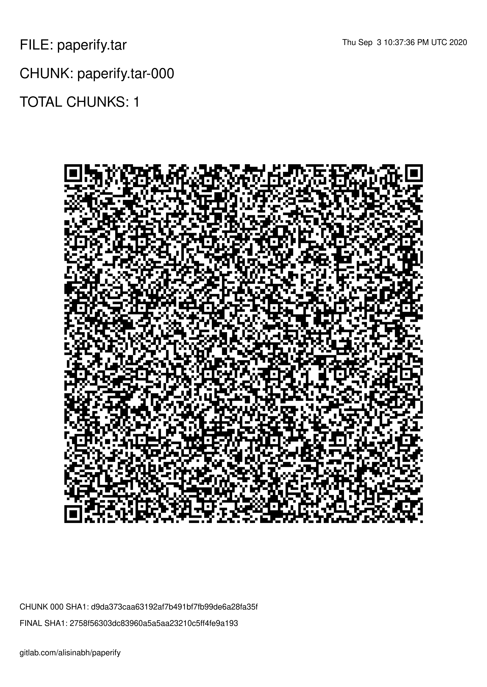

# Paperify


Use QR codes to backup your data on papers. Simply backup your files, print them and store them in a safe place.

## Sample



## Requirements

Make sure you have these binaries installed on your system.

 - `qrencode` (qrencode)
 - `convert` (imagemagick)
 - `zbarimg` (zbar >= 0.23.1) __only for decoding with digitallify.sh__
 
**Zbar**: Binary support is just added in zbar `0.23.1` and not supported in earlier versions.
Please verify that your zbar version is higher or equal to `0.23.1`. You can do that by running 
```
zbarimg --version
0.23.1
```
You can download and build zbar from [github.com/mchehab/zbar/](https://github.com/mchehab/zbar/).
Note that zbar is **not** required for `paperify.sh` It is only required for `digitallify.sh` decoding.

### Mac OS X

To install the requirements you can use Homebrew.

```
brew install coreutils qrencode zbarimg
```

## Installation

These are just bash scripts. There is no need to install them.

You can either use git to clone this repo or download it in zip.

```
git clone https://github.com/alisinabh/paperify.git && cd paperify
# --- OR ---
wget https://github.com/alisinabh/paperify/archive/master.zip -O paperify.zip && \
     unzip paperify.zip && cd paperify-master
```

Or you can use paperify's Docker image at alisinabh/paperify. More details below.

## Usage
```
# Creates FILE-qr directory with generated qr codes inside.
# Then you can print those files and store them.
./paperify.sh FILE


# Reads all files inside the DIRECTORY which you have all your
# scanned pages inside. Make sure the file namings are correct 
./digitalify.sh OUTPUT_FILE DIRECTORY
```


### Use with Docker

You can mount your files at `/target` in paperify's docker container. Then run paperify.

For simplicity, You can just copy the bellow commands which will mount your current directory automatically.

```
# To Paperify
# FIRST: cd into the folder that your file is in
docker run -v$(pwd):/target alisinabh/paperify FILE

# To Digitallify
# First cd into the folder that your scanned images are in
docker run -v$(pwd):/target --entrypoint=/paperify/digitallify.sh alisinabh/paperify OUTPUT_FILE .
```

## Recommendations

### Multiple files

Use tarballs and gzip to store and compress your data.
```
tar cvfz files.tgz file1.txt file2.txt
```

### Encryption

To protect your data you can encrypt them using `gpg` (GnuPG).
```
gpg --symmetric file.txt
```
Then use `file.txt.gpg` in paperify. 

## License
Peperify is licensed in GPL-3.0

Read more in [LICESE](LICENSE)
